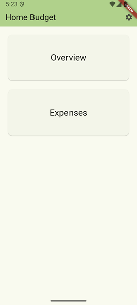
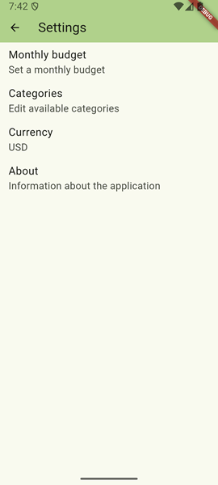
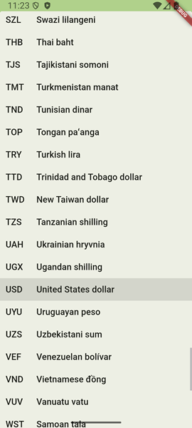
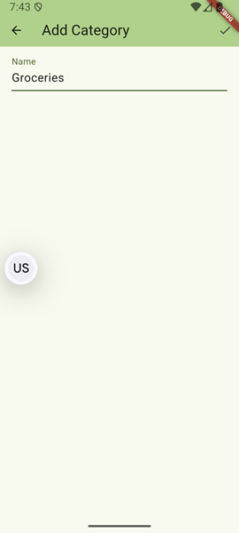
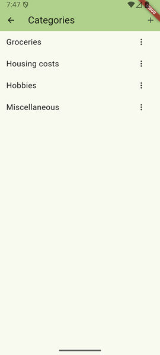
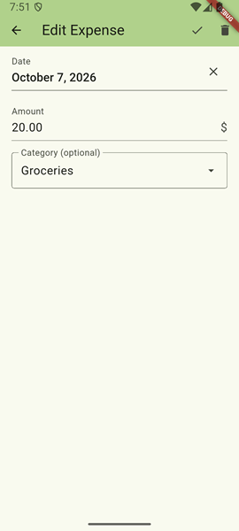
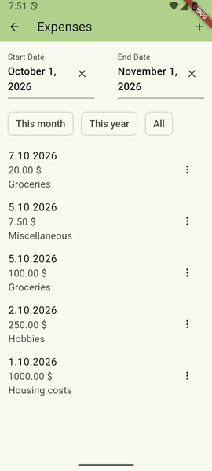
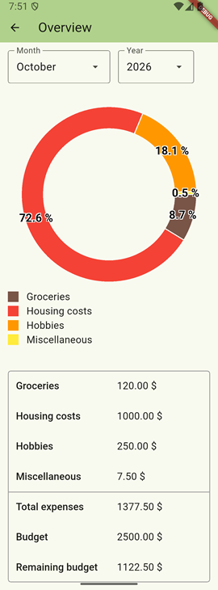

# Demo

## Features

### Localizations

The default language of the application is English.

If the device language is set to Finnish, the user interface is displayed in Finnish.

### Settings

There are three settings to configure:
- Budget
- Categories
- Currency

#### Budget

The budget is defined as a monthly budget.

#### Currency

The currency can be selected from a list of options. The default currency is set according to the user's locale.

#### Categories

It is possible to create, edit and delete categories for expenses. Creating categories and setting categories for expenses is optional.

### Expenses

It is possible to create, edit and delete expenses. When creating or editing an expense, the date and the amount must be specified. Selecting a category for an expense is optional.

The complete list of expenses can be filtered by date. 

### Overview

An overview of expenses is available for each month. The view is suitable for comparing expenses of different categories and keeping track of the remaining budget.

## Ideas for further development

**Language setting**

The language of the UI currently depends on the language of the operating system. Adding a setting for the language would allow selecting a different language for this application.

**Localized date and number formats**

The application currently supports only one date format, but this could be improved by selecting the date format by locale or by allowing the user to select the preferred date format.

Expenses are formatted so that the number of decimal places depends on the selected currency. However, the locale could be considered e.g. when selecting the decimal separator.

**Precision of numerical values**

Computations on double values can lead to losing precision, which is why options for avoiding loss of precision could be considered.

**Performance considerations**

Ensuring performance with large amounts of data could require further development, e.g. considering how expenses could be loaded in smaller chunks. Additionally, the application could include a tool for deleting all expenses from before a given date.

**Security considerations**

The implementation was not designed for maximizing data security, so further development could include considering options for improving security.